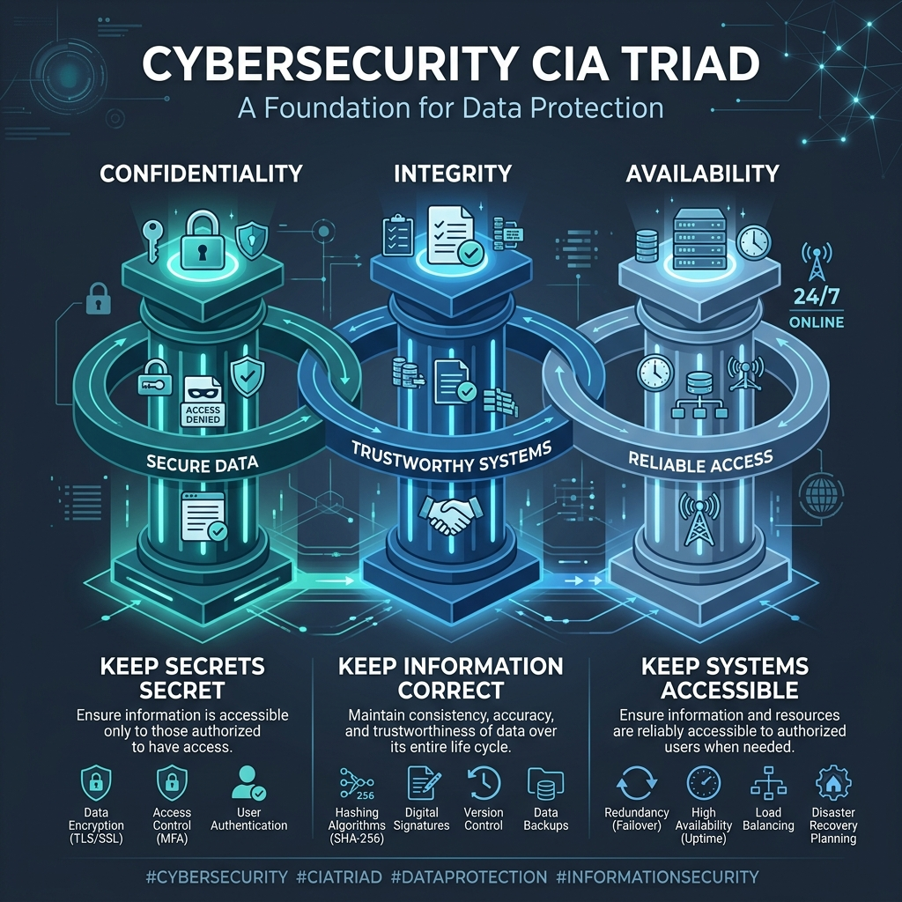

# CIA Triad Cybersecurity Refresher 🔐



A beginner-friendly cybersecurity awareness project that explains the **CIA Triad** (Confidentiality, Integrity, and Availability) using simple banking examples.

This project turns a core security concept into an easy-to-understand training resource for students, new cybersecurity professionals, and nontechnical audiences.

## Project Overview

The CIA Triad is the foundation behind many cybersecurity controls, policies, and job responsibilities. At its core, Confidentiality is about keeping secrets secret, Integrity focuses on keeping information correct, and Availability ensures that systems and information remain accessible when needed.

The interactive web application uses relatable banking scenarios to show what each pillar looks like when it is protected and when it is broken.

## Features

- **Interactive UI**: A modern, responsive React-based interface with semantic HTML and accessibility in mind.
- **CIA Pillar Breakdown**: Deep dives into Confidentiality, Integrity, and Availability with practical banking scenarios (Protected vs. Compromised).
- **Security Controls**: Connects each pillar to real-world defensive controls like encryption, backups, and checksums.
- **Career Pathways**: Outlines how the CIA triad maps to cybersecurity roles like Penetration Testers, Auditors, Program Managers, and Security Engineers.
- **Knowledge Check Quiz**: Features an interactive 10-question quiz with dynamic scoring and detailed explanations for incorrect answers to reinforce learning.

## Technologies Used

- **React 18**
- **TypeScript**
- **Vite**
- **CSS3 / Semantic HTML**
- **Lucide Icons**

## Learning Objectives

By the end of this refresher, learners should be able to:

1. Define Confidentiality, Integrity, and Availability.
2. Identify which CIA pillar is affected in a security scenario.
3. Connect common cybersecurity controls to each pillar.
4. Explain how cybersecurity roles help protect the CIA Triad.

## Security Controls

### Confidentiality
We enforce confidentiality using tools like strong passwords, data encryption, physical access controls, and multifactor authentication.

### Integrity
To maintain integrity, professionals rely on checksums, digital signatures, detailed audit logs, and continuous change monitoring.

### Availability
Keeping systems available involves maintaining secure backups, building redundant systems, planning for disaster recovery, and implementing robust DDoS protection.

## Cybersecurity Career Connection

The CIA Triad applies across many cybersecurity roles. Penetration Testers actively identify weaknesses that could expose, alter, or disrupt systems. Auditors are responsible for verifying that security controls and requirements are strictly followed. Meanwhile, Program Managers coordinate overarching security initiatives and risk-reduction efforts, and Security Engineers focus on designing and maintaining robust technical defenses.

## Screenshots

> Add screenshots of the interactive quiz and the banking scenarios section here.

## Skills Demonstrated

This project demonstrates a solid understanding of cybersecurity fundamentals and security awareness training. It also highlights strong technical communication and web application development skills, along with practical experience in risk scenario analysis and the ability to translate complex technical concepts for nontechnical audiences.

## Future Improvements

Looking ahead, I plan to include more diverse workplace and cloud-security scenarios. I will also be mapping these practical examples directly to the NIST Cybersecurity Framework functions.

## Author

**Janet Kesinro**

Cybersecurity professional focused on vulnerability management, risk, security education, and practical security solutions.

## Installation Instructions

To run this web application locally, ensure you have Node.js installed, then run the following commands:

```bash
git clone https://github.com/JanetKesinro/CIA-Triad-Overview.git
cd CIA-Triad-Overview
npm install
```

## Usage Instructions

Start the local development server:

```bash
npm run dev
```

Open your browser and navigate to `http://localhost:5173` to explore the interactive portfolio project and take the knowledge check quiz.

## License

This project is licensed under the MIT License.
